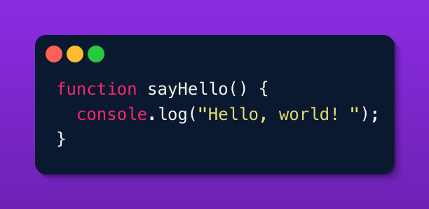

[](https://www.npmjs.com/package/code-snippet-image-generator) [](https://opensource.org/licenses/GNU) [](https://github.com/sirsjg/snippets/issues) [](https://github.com/sirsjg/snippets/actions)

# Code Snippet Image Generator

A Node.js library to transform code snippets into beautiful, customizable images with syntax highlighting.



## Features

- Convert any code snippet to a visually appealing image
- Syntax highlighting with a Monokai-like theme
- Customizable styling (colors, dimensions, fonts)
- Adaptive image sizing based on code content
- Terminal-style window with control buttons
- Beautiful gradient backgrounds
- Drop shadow effects for a modern look

## Installation

```bash
npm install code-snippet-image-generator
```

## Usage

### Basic Example

```javascript
const { generateCodeImage } = require('code-snippet-image-generator');

const code = `function helloWorld() {
  console.log("Hello, world!");
}

helloWorld();`;

// Generate with default options
generateCodeImage(code, {
  outputPath: 'my-code-snippet.png'
});
```

### Advanced Configuration

```javascript
const { generateCodeImage } = require('code-snippet-image-generator');

const code = `// Your complex code here...`;

generateCodeImage(code, {
  backgroundColor: "#6c5ce7", // Purple background
  outputPath: "custom-code-snippet.png",
  width: 1400,                // Custom width
  height: 1000,               // Custom height
  padding: 70,                // Padding around the code
  fontFamily: "Fira Code",    // Custom font (must be registered)
  fontSize: 28,               // Larger text
  lineHeight: 1.7,            // More spacing between lines
  terminalRadius: 18,         // More rounded corners
  controlButtonRadius: 14,    // Larger control buttons
  controlButtonSpacing: 30    // More space between buttons
});
```

## API Reference

### Functions

#### `codeToImage(code, options)`

Generates an image from a code snippet.

- **Parameters**:
  - `code` (string): The code snippet to display
  - `options` (Object): Configuration options
- **Returns**: Promise\<Buffer\> - Image buffer

#### `saveImage(imageBuffer, outputPath)`

Saves the generated image to a file.

- **Parameters**:
  - `imageBuffer` (Buffer): The image buffer
  - `outputPath` (string): Path to save the image
- **Returns**: Promise\<void\>

#### `generateCodeImage(code, options)`

Generates a code image and saves it to file.

- **Parameters**:
  - `code` (string): The code snippet
  - `options` (Object): Configuration options
- **Returns**: Promise\<string\> - Path to the saved image

### Configuration Options

| Option | Type | Default | Description |
|--------|------|---------|-------------|
| `backgroundColor` | string | "#ff3366" | Base color for background (hex format) |
| `outputPath` | string | "code-snippet.png" | Path to save the image |
| `width` | number | *adaptive* | Canvas width (calculated based on content if not specified) |
| `height` | number | *adaptive* | Canvas height (calculated based on content if not specified) |
| `padding` | number | 50 | Padding around the code |
| `fontFamily` | string | "monospace" | Font family for code |
| `fontSize` | number | 24 | Font size for code |
| `lineHeight` | number | 1.5 | Line height for code |
| `terminalRadius` | number | 15 | Radius for terminal window corners |
| `controlButtonRadius` | number | 12 | Radius for control buttons |
| `controlButtonSpacing` | number | 25 | Spacing between control buttons |

## Custom Fonts

To use custom fonts, you need to register them first:

```javascript
const { registerFont } = require('canvas');
const { generateCodeImage } = require('code-snippet-image-generator');

// Register a custom font
registerFont('path/to/FiraCode-Regular.ttf', { family: 'Fira Code' });

// Then use it in your options
generateCodeImage(code, {
  fontFamily: 'Fira Code',
  // Other options...
});
```

## How It Works

1. The library takes your code snippet and calculates the optimal dimensions
2. It creates a canvas with a gradient background
3. It draws a terminal-like window with control buttons
4. Your code is rendered with syntax highlighting
5. The image is saved to the specified output path

## License

GNU GENERAL PUBLIC LICENSE

## Contributing

Contributions are welcome! Please feel free to submit a Pull Request.